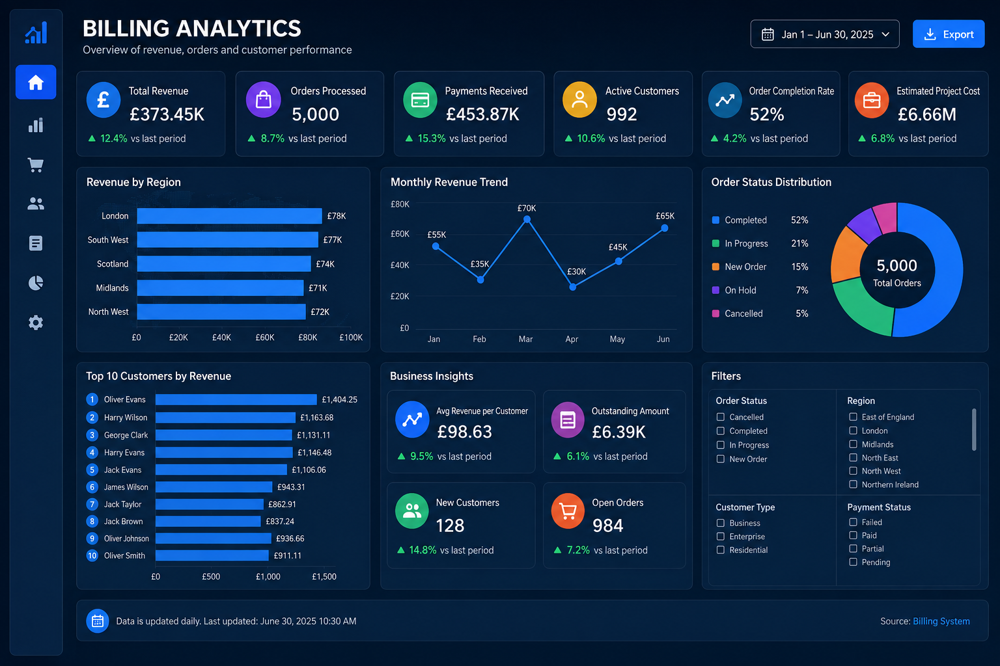

# 📊 Billing Analytics Dashboard

An end-to-end Business Intelligence project built using **Power BI, SQL, MySQL, DAX and Power Query**. The dashboard provides actionable insights into billing operations, customer revenue, payments, regional performance, and order completion.

## Dashboard Preview



## Project Overview

This project simulates a telecom billing environment and demonstrates the complete BI workflow:

- Data extraction from SQL/MySQL
- ETL using Power Query
- Star schema data modeling
- DAX measures & KPIs
- Interactive Power BI visualizations

## Tools & Technologies

- Power BI
- SQL & MySQL
- DAX
- Power Query
- Microsoft Excel

## Key KPIs

| KPI | Description |
|------|-------------|
| Total Revenue | Overall billed revenue |
| Orders Processed | Total customer orders |
| Payments Received | Revenue collected |
| Active Customers | Unique active customers |
| Order Completion Rate | Completed vs Total Orders |
| Estimated Project Cost | Forecast operational cost |

## Dashboard Pages

### 1. Executive Overview
- Revenue by Region
- Monthly Revenue Trend
- Order Status Distribution
- KPI Summary Cards

### 2. Revenue & Customer Analysis
- Top 10 Customers
- Outstanding Amount
- Average Revenue per Customer
- Payment Status Analysis
- Customer Type Segmentation

## Business Insights

- Identify high-performing regions
- Monitor monthly revenue growth
- Track customer payment behavior
- Analyze operational order completion
- Support data-driven decision making

## Repository Structure

```
Billing-Analytics-Dashboard/
│── README.md
│── dashboard-showcase.png
│── Billing_Analytics_Dashboard.pbix
│── dataset/
└── screenshots/
```

## Author

**Shakila Azhagesan**

Data Analyst | Power BI Developer | Business Intelligence Analyst
